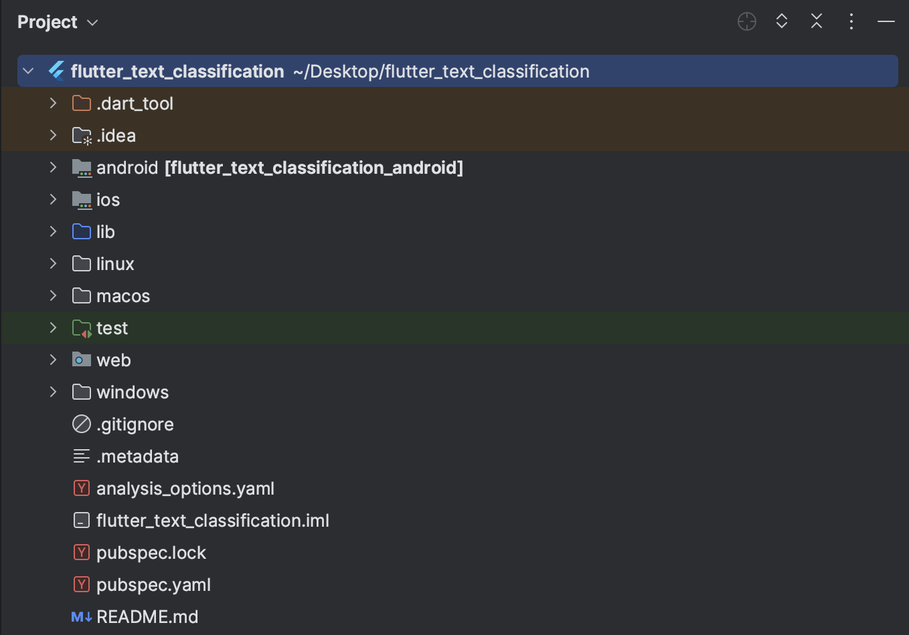
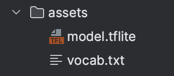
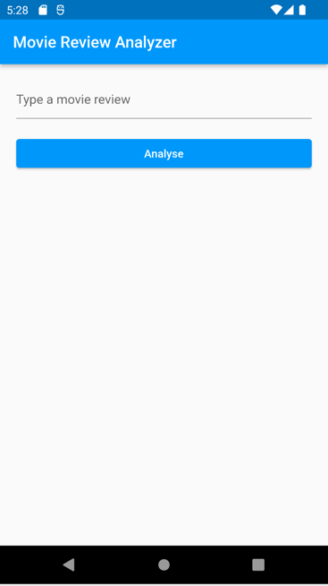

summary: Building text classifier with Flutter and TFLite
id: text-classifier-flutter-tflite
categories: Flutter, TensorFlow Lite, Applied Machine Learning
environments: Web
status: Published
tags: flutter, tensorflow-lite, text-classifier, NLP
authors: Markandey Pathak
feedback link: markandeypathak@live.com

# Building text classifier with Flutter and TFLite

## Overview

Duration: 0:05:00

Welcome to the workshop **Building text classifier with Flutter and TFLite**. In this workshop, we will learn how to
build an NLP classifier using Flutter and TensorFlow Lite. We'll cover

- Machine Learning basics
- Setting up development environment
- Writing a simple Flutter application, and
- Integrating TensorFlow Lite.

We will use a
pre-trained [Tensorflow Lite Model](https://storage.googleapis.com/download.tensorflow.org/models/tflite/text_classification/text_classification.tflite).
By the end, you'll have the skills to build more sophisticated cross-platform applications with machine learning
capabilities.

### What we will build


### What will you need?

1. A **positive** attitude
2. Laptop (Windows/Linux/Mac)

## Flutter

Duration: 0:10:00

### What is Flutter

Flutter is a free and open-source cross-platform application development framework created by **Google**. It allows
developers to build high-quality, cross-platform apps for _Android_, _iOS_, _macOS_, _Linux_, _Windows_ and _Web_
platforms using a single codebase. Flutter uses the **Dart** programming language and provides a rich set of pre-built
widgets that are customizable to fit your design needs. It also includes a powerful set of tools and features such as
hot-reload for rapid development, platform-specific APIs, and easy integration with backend services. Whether you're a
beginner or an experienced developer, Flutter makes it easy to create beautiful, performant, and engaging mobile apps.

### Why Flutter?

Here are a few reasons why you might want to consider using Flutter for your mobile app development:

1. Cross-platform development: Flutter allows you to build high-quality, natively compiled apps for both several
   platforms with a single codebase. This means you can save time and resources on development and maintenance of two
   separate codebases.

2. Fast development: Flutter's hot-reload feature allows you to see the changes you make to your code in real-time,
   making the development process faster and more efficient.

3. Rich set of pre-built widgets: Flutter comes with a wide range of customizable widgets that can help you create
   beautiful and responsive user interfaces.

4. High-performance: Flutter's Dart programming language and native compilation enable it to deliver high performance,
   even on older devices.

5. Easy to learn: Flutter's easy-to-understand syntax and extensive documentation make it accessible to developers of
   all skill levels.

6. Growing community: Flutter has a rapidly growing community of developers who are constantly creating new packages,
   plugins, and widgets, which means you can benefit from a rich ecosystem of tools and resources.

Overall, if you're looking for a flexible, fast, and efficient way to build high-quality cross-platform apps, Flutter is
definitely worth considering.

### Environment Setup

Setting up your Flutter development environment involves installing Flutter, configuring your IDE, setting up your
Android/iOS devices or emulators, configuring your PATH environment variable, and verifying your installation using
the `flutter doctor` command.

We will follow the [official guide](https://docs.flutter.dev/get-started/install) to configure our development
environment

### Create a new flutter project

```bash
flutter create flutter_text_classification
```

Above command will generate the boilerplate flutter project. Open the project folder with your favorite IDE. The folder
structure will look something like below



## Tensorflow & Tensorflow Lite

Duration: 0:05:00

### Tensorflow

TensorFlow is an open-source software library used for building and training machine learning models. It can be used for
a wide range of applications such as image recognition, speech recognition, and even playing games. TensorFlow is highly
scalable and can run on a variety of devices, including CPUs, GPUs, and TPUs.

### Tensorflow Lite

TensorFlow Lite, on the other hand, is a lightweight version of TensorFlow that is designed to run on mobile and
embedded devices with limited computing power. It's optimized for running machine learning models on mobile devices such
as smartphones and tablets, and can be used for a variety of applications, including object detection, face recognition,
and even predictive text input.

TensorFlow Lite offers several benefits, including:

1. Reduced model size: TensorFlow Lite models are optimized for mobile and embedded devices, which means they are
   smaller and use fewer resources than their full-scale TensorFlow counterparts.

2. Faster inference: TensorFlow Lite models are designed to run faster on mobile and embedded devices, making them ideal
   for real-time applications like object detection or face recognition.

3. Lower power consumption: TensorFlow Lite models use less power than their full-scale counterparts, which is important
   for battery-powered devices like smartphones and wearables.

4. Flexibility: TensorFlow Lite models can be easily integrated into mobile apps or embedded systems, making it easy to
   add machine learning capabilities to existing applications.

5. Privacy: TensorFlow Lite can be used to build models that run locally on a device, which means that data does not
   need to be sent to the cloud for processing, enhancing privacy and security.

Overall, TensorFlow Lite is a powerful tool for anyone looking to build machine learning models for mobile and embedded
devices. It offers several benefits that make it an ideal choice for developers who want to build efficient, fast, and
flexible machine learning models that can run on a variety of devices.

## Tensorflow to Tensorflow Lite Model

Duration: 0:02:00

TensorFlow Lite provides a simple and efficient way to convert TensorFlow models into a format that can be run on mobile
and embedded devices. The conversion process optimizes the model for deployment on devices with limited computational
resources, resulting in smaller and faster models. TensorFlow Lite also provides tools for quantizing models, reducing
the number of bits needed to represent model parameters, further reducing model size and increasing inference speed.
Overall, converting TensorFlow models to TensorFlow Lite enables developers to deploy machine learning models on a wide
range of devices, including smartphones, wearables, and IoT devices, and provides a faster and more efficient user
experience.

The model used in this workshop is TFLite version
of [this](https://colab.research.google.com/github/tensorflow/hub/blob/master/examples/colab/tf2_text_classification.ipynb).

## `tflite_flutter` Plugin

Duration: 0:03:00

### Overview

[TensorFlow Lite Flutter](https://pub.dev/packages/tflite_flutter) plugin provides a flexible and fast solution for
accessing TensorFlow Lite interpreter and performing inference. The API is similar to the TFLite Java and Swift APIs. It
directly binds to TFLite C API making it efficient (low-latency).

Key Features

- Multi-platform Support for Android, iOS, Windows, Mac, Linux.
- Flexibility to use any TFLite Model.
- Acceleration using multi-threading and delegate support.
- Similar structure as TensorFlow Lite Java API.
- Inference speeds close to native Android Apps built using the Java API.
- You can choose to use any TensorFlow version by building binaries locally.
- Run inference in different isolates to prevent jank in UI thread.

### Installation

`tflite_flutter` requires setting up tensorflow libraries for various environments. To do this, we will
follow [official plugin guidelines](https://pub.dev/packages/tflite_flutter#important-initial-setup--add-dynamic-libraries-to-your-app)

### Model & Vocab

`tflite_flutter` plugin allows us to load a tflite model from file system.

Let's download
the [Tensorflow Lite Model](https://storage.googleapis.com/download.tensorflow.org/models/tflite/text_classification/text_classification.tflite)
and [Vocabulary](./assets/vocab.txt)

We will place the downloaded model in `assets` folder at our project root.

For simplicity, we will rename the model to `model.tflite`.



## Flutter UI

Duration 0:10:00

### Everything is a Widget

Widgets are the building blocks of a Flutter application and represent the visual elements on the screen, such as
buttons, text, images, and more.

Some basic widgets in Flutter include:

- `Text`: used to display text on the screen
- `Image`: used to display images on the screen
- `Container`: used to group other widgets together and provide padding and margin
- `Row` and `Column`: used to lay out widgets horizontally or vertically
- `Button`: used to create interactive buttons that respond to user input
- `TextField`: used to allow users to input text
- `Scaffold`: used to provide basic app layout elements, such as an app bar and navigation drawer.

Widgets can also be customized by changing their properties, such as font size, color, and background color, to match
the design of the application.

Flutter widgets are organized in a hierarchy, with the top-level widget representing the entire screen and nested
widgets representing the individual elements on the screen. This makes it easy to create complex layouts and user
interfaces.

### Stateless Widget

In Flutter, a StatelessWidget is a type of widget that represents a piece of the user interface that does not change
over time. This means that it has no internal state and does not update itself in response to user interactions or
changes in data.

A common use case for a StatelessWidget is to display static content that does not need to be updated, such as text,
images, or icons. To create a StatelessWidget in Flutter, you need to create a class that extends the StatelessWidget
class and override the build method. The build method returns a Widget that describes the visual elements of the user
interface.

Here is an example of a StatelessWidget that displays a piece of text:

```dart
class MyTextWidget extends StatelessWidget {
  @override
  Widget build(BuildContext context) {
    return Text(
      'Hello, World!',
      style: TextStyle(fontSize: 24),
    );
  }
}
```

In this example, we define a new class called MyTextWidget that extends the StatelessWidget class. In the build method,
we return a Text widget that displays the text "Hello, World!" with a font size of 24.

### Stateful Widget

A StatefulWidget is a type of widget that can change its internal state during its lifetime. This means that a
StatefulWidget can be updated in response to user interactions or changes in data.

A common use case for a StatefulWidget is to display dynamic content that can change over time, such as a list of items
or a form. To create a StatefulWidget in Flutter, you need to create a class that extends the StatefulWidget class and
override two methods: createState and build.

The createState method returns a State object that manages the internal state of the widget, while the build method
returns a Widget that describes the visual elements of the user interface.

Here is an example of a StatefulWidget that displays a counter and increments it when a button is pressed:

```dart
class MyCounterWidget extends StatefulWidget {
  const MyCounterWidget({super.key});

  @override
  State<MyCounterWidget> createState() => _MyCounterWidgetState();
}

class _MyCounterWidgetState extends State<MyCounterWidget> {
  int _counter = 0;

  void _incrementCounter() {
    setState(() {
      _counter++;
    });
  }

  @override
  Widget build(BuildContext context) {
    return Column(
      children: [
        Text(
          'Counter: $_counter',
          style: TextStyle(fontSize: 24),
        ),
        ElevatedButton(
          onPressed: _incrementCounter,
          child: Text('Increment'),
        ),
      ],
    );
  }
}
```

## Building our primary Screen

Duration: 0:05:00

Below Flutter code creates a user interface with a blue material theme and disabled debug banner, containing a text
input box and a button for analyzing a movie review.

The code sets up a `MaterialApp` widget with the specified theme and debug banner settings, and sets the home screen to
be a Scaffold widget. The body of the `Scaffold` widget arranges its child widgets in a vertical column. The `Column`
widget is given a padding of 20 units on all sides.

Inside the Column widget, there is a `TextField` widget that provides a text input box for the user to type in a movie
review. Below the text input box, there is an `ElevatedButton`. This button is used to trigger an action when the user
wants to analyse the movie review that they have entered. The `onPressed` callback of the ElevatedButton widget can be
used to define the logic for the analyse button press.

Replace the contents of `main.dart` in your `lib` folder with the code below.

```dart
import 'package:flutter/material.dart';

void main() {
  runApp(const TextClassifierApp());
}

class TextClassifierApp extends StatefulWidget {
  const TextClassifierApp({super.key});

  @override
  State<TextClassifierApp> createState() => _TextClassifierAppState();
}

class _TextClassifierAppState extends State<TextClassifierApp> {
  @override
  Widget build(BuildContext context) {
    return MaterialApp(
      debugShowCheckedModeBanner: false,
      theme: ThemeData(
        primarySwatch: Colors.blue,
      ),
      home: Scaffold(
        appBar: AppBar(
          title: const Text('Movie Review Analyzer'),
        ),
        body: Padding(
          padding: const EdgeInsets.all(20),
          child: Column(
            crossAxisAlignment: CrossAxisAlignment.stretch,
            children: [
              const TextField(
                decoration: InputDecoration(
                  hintText: 'Type a movie review',
                ),
              ),
              const SizedBox(height: 20),
              ElevatedButton(
                onPressed: () {
                  // Analyse button on press logic goes here
                },
                child: const Text('Analyse'),
              ),
            ],
          ),
        ),
      ),
    );
  }
}
```

### Running the flutter app

It's time to run the flutter app and see it in action. To launch the application:

1. Open your Flutter project in Visual Studio Code.
2. Ensure that you have installed the Flutter extension in Visual Studio Code. If not, install the Flutter extension by
   going to the Extensions tab on the left sidebar and searching for "Flutter".
3. Open the `main.dart` file.
4. Select your Android or iOS emulator
5. Press F5 or select "Run" from the Run menu in the top toolbar of Visual Studio Code.

That's it! You have now launched your Flutter application using the VS Code Flutter extension.



You can make changes to your code and see them reflected in your app in real-time using Hot Reload, which is enabled by
default in Flutter.

## Building our Classifier

Duration: 0:10:00

To analyse the text (movie review) entered by user, we need to build a Classifier which will tokenize the input text,
create an interpreter from our download tflite model and then run the classification.

Create a new file `classifier.dart` inside `lib` folder and enter the below code.

```dart
import 'package:flutter/foundation.dart';
import 'package:flutter/services.dart';

// Import tflite_flutter
import 'package:tflite_flutter/tflite_flutter.dart';

class Classifier {
  // name of the model file
  final _modelFile = 'model.tflite';
  final _vocabFile = 'vocab.txt';

  // Maximum length of sentence
  final int _sentenceLen = 256;

  final String start = '<START>';
  final String pad = '<PAD>';
  final String unk = '<UNKNOWN>';

  late Map<String, int> _dict;

  // TensorFlow Lite Interpreter object
  late Interpreter _interpreter;

  Classifier() {
    // Load model when the classifier is initialized.
    _loadModel();
    _loadDictionary();
  }

  void _loadModel() async {
    // Creating the interpreter using Interpreter.fromAsset
    _interpreter = await Interpreter.fromAsset(_modelFile);
    if (kDebugMode) {
      print('Interpreter loaded successfully');
    }
  }

  void _loadDictionary() async {
    final vocab = await rootBundle.loadString('assets/$_vocabFile');
    var dict = <String, int>{};
    final vocabList = vocab.split('\n');
    for (var i = 0; i < vocabList.length; i++) {
      var entry = vocabList[i].trim().split(' ');
      dict[entry[0]] = int.parse(entry[1]);
    }
    _dict = dict;
    if (kDebugMode) {
      print('Dictionary loaded successfully');
    }
  }

  List<double> classify(String rawText) {
    // tokenizeInputText returns List<List<double>>
    // of shape [1, 256].
    List<List<double>> input = tokenizeInputText(rawText);

    // output of shape [1,2].
    var output = List<double>.filled(2, 0).reshape([1, 2]);

    // The run method will run inference and
    // store the resulting values in output.
    _interpreter.run(input, output);

    return [output[0][0], output[0][1]];
  }

  List<List<double>> tokenizeInputText(String text) {
    // Whitespace tokenization
    final tokens = text.split(' ');

    // Create a list of length==_sentenceLen filled with the value <pad>
    var vec = List<double>.filled(_sentenceLen, _dict[pad]!.toDouble());

    var index = 0;
    if (_dict.containsKey(start)) {
      vec[index++] = _dict[start]!.toDouble();
    }

    // For each word in sentence find corresponding index in dict
    for (var tok in tokens) {
      if (index > _sentenceLen) {
        break;
      }
      vec[index++] = _dict.containsKey(tok)
          ? _dict[tok]!.toDouble()
          : _dict[unk]!.toDouble();
    }

    // returning List<List<double>> as our interpreter input tensor expects the shape, [1,256]
    return [vec];
  }
}
```

## Perform Classification

Duration: 0:10:00

When the user enters the text and taps the button, we can read the entered review and use `classify()` to get the
classification probabilities.

```dart
final Classifier _classifier = Classifier();
final predictions = _classifier.classify("entered review");
final negative_prob = predictions[0];
final positive_prob = predictions[1];
```

To read the input from the `TextField`, we can use `TextEditingController`. `TextEditingController` allows us to programmatically interact with the `TextField`. 

```dart
final TextEditingController _controller = TextEditingController();

TextField(
  ...
  controller: _controller)
```

We will create two state variables `review` and `predictions` to update the UI

```dart
String review = "";
List<double> predictions = [];
```

To handle the pressed event of `ElevatedButton`, `onPressed` parameter can be used. We will read the input, perform classification and finally update the state.

```dart
ElevatedButton (
  onPressed: () {
    setState(() {
        review = _controller.text;
        predictions = _classifier.classify(review);
    });
    _controller.clear();
})
```

We can then display the updated state values using `Card` widget.

```dart
Card(
  children: <Widget>[
    ListTile(
      title: Text('Review: $review'),
      subtitle: Text('Positive: ${predictions[1].toStringAsFixed(4)}\nNegative: ${predictions[0].toStringAsFixed(4)}')),
  ],
)
```

Below is how the final `main.dart` should look like:

```dart
import 'package:flutter/material.dart';
import 'classifier.dart';

void main() {
  runApp(const TextClassifierApp());
}

class TextClassifierApp extends StatefulWidget {
  const TextClassifierApp({super.key});

  @override
  State<TextClassifierApp> createState() => _TextClassifierAppState();
}

class _TextClassifierAppState extends State<TextClassifierApp> {
  final TextEditingController _controller = TextEditingController();
  final Classifier _classifier = Classifier();
  String review = "";
  List<double> predictions = [];

  @override
  void initState() {
    super.initState();
  }

  @override
  Widget build(BuildContext context) {
    return MaterialApp(
      debugShowCheckedModeBanner: false,
      theme: ThemeData(
        primarySwatch: Colors.blue,
      ),
      home: Scaffold(
        appBar: AppBar(
          title: const Text('Movie Review Analyzer'),
        ),
        body: Padding(
          padding: const EdgeInsets.all(20),
          child: Column(
            crossAxisAlignment: CrossAxisAlignment.stretch,
            children: [
              TextField(
                decoration: const InputDecoration(
                  hintText: 'Type a movie review',
                ),
                controller: _controller,
              ),
              const SizedBox(height: 20),
              ElevatedButton(
                  child: const Text('Analyse'),
                  onPressed: () {
                    setState(() {
                      review = _controller.text;
                      predictions = _classifier.classify(review);
                    });
                    _controller.clear();
                  }),
              const SizedBox(height: 20),
              if (predictions.length == 2)
                Card(
                  color: predictions[1] > predictions[0]
                      ? Colors.lightGreen
                      : Colors.red,
                  child: Column(
                    mainAxisSize: MainAxisSize.min,
                    children: <Widget>[
                      ListTile(
                          leading: const Icon(Icons.question_answer_outlined),
                          title: Text(
                            'Review: $review',
                            style: const TextStyle(fontSize: 20, color: Colors.white),
                          ),
                          subtitle: Text(
                            'Positive: ${predictions[1].toStringAsFixed(4)}\nNegative: ${predictions[0].toStringAsFixed(4)}',
                            style: const TextStyle(fontSize: 15, color: Colors.white),
                          )),
                    ],
                  ),
                )
              else
                Container()
            ],
          ),
        ),
      ),
    );
  }
}
```

## Final app
Duration: 0:05:00

That's it, the application is now ready to be tested. 


Duration: 0:00:00

## Congratulations

